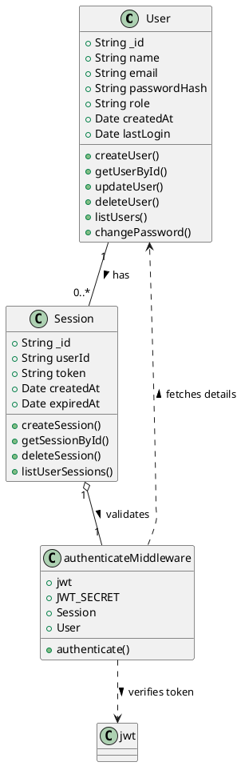

# List of controllers per database schema

1. User Controllers (userControllers.js)
    - createUser: Registers a new user.         
    - getUserById: Retrieves a user's information by their ID.   
    - updateUser: Updates user profile information.
    - deleteUser: Removes a user from the database.
    - listUsers: Lists all users (with optional filters, e.g., by role).
    - authenticateUser: Authenticates a user's credentials and returns a token/session.
    - changePassword: Allows a user to change their password.
2. Session Controllers (sessionControllers.js)
    - createSession: Creates a new user session.
    - getSessionById: Retrieves session details by its ID.
    - deleteSession: Deletes a user's session, effectively logging them out.
    - listSessions: Lists all active sessions for a user or system-wide (admin functionality).
3. Project Controllers (projectControllers.js)
    - createProject: Creates a new project.
    - getProjectById: Retrieves project details by its ID.
    - updateProject: Updates project information.
    - deleteProject: Deletes a project.
    - listProjects: Lists all projects (with optional filters, e.g., by user, status).
    - addMemberToProject: Adds a new member to the project.
    - removeMemberFromProject: Removes a member from the project.
4. Task Controllers (taskControllers.js)
    - createTask: Creates a new task within a project.
    - getTaskById: Retrieves details of a specific task.
    - updateTask: Updates task details.
    - deleteTask: Deletes a task from the project.
    - listTasks: Lists tasks within a project or for a specific user (with optional filters, e.g., by status, priority).
    - assignTask: Assigns or reassigns a task to a user.
    - logTaskTime: Logs time spent on a task.
  
---

## Here we will illustrate the relationship for the authentication middleware and the controllers

The aim is to have a solid understanding of how the authentication middleware and the controllers interact with each other.

