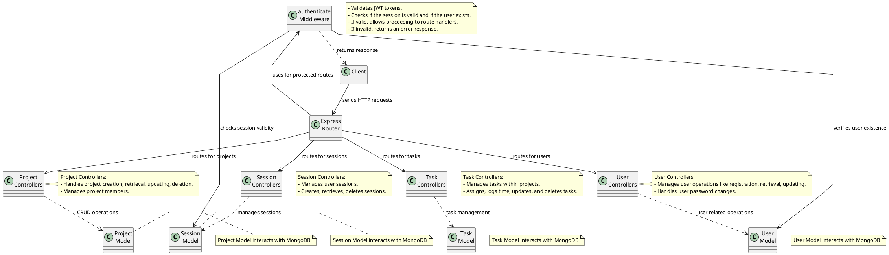

# This document will provide an overview of the architecture of the server

```plantuml

@startuml
skinparam linetype polyline
!define RECTANGLE class

RECTANGLE Client
RECTANGLE "Express\nRouter" as ExpressRouter

RECTANGLE "Project\nModel" as ProjectModel
RECTANGLE "Session\nModel" as SessionModel
RECTANGLE "User\nModel" as UserModel
RECTANGLE "Task\nModel" as TaskModel

RECTANGLE "Project\nControllers" as ProjectControllers
RECTANGLE "Session\nControllers" as SessionControllers
RECTANGLE "User\nControllers" as UserControllers
RECTANGLE "Task\nControllers" as TaskControllers

RECTANGLE "authenticate\nMiddleware" as AuthMiddleware

' Relationships
Client --> ExpressRouter : sends HTTP requests

ExpressRouter --> AuthMiddleware : uses for protected routes
AuthMiddleware --> UserModel : verifies user existence
AuthMiddleware --> SessionModel : checks session validity
AuthMiddleware ..> Client : returns response

ExpressRouter --> ProjectControllers : routes for projects
ProjectControllers ..> ProjectModel : CRUD operations

ExpressRouter --> SessionControllers : routes for sessions
SessionControllers ..> SessionModel : manages sessions

ExpressRouter --> UserControllers : routes for users
UserControllers ..> UserModel : user related operations

ExpressRouter --> TaskControllers : routes for tasks
TaskControllers ..> TaskModel : task management

' Notes
note right of AuthMiddleware
  'authenticate' Middleware:
  - Validates JWT tokens.
  - Checks if the session is valid and if the user exists.
  - If valid, allows proceeding to route handlers.
  - If invalid, returns an error response.
end note

note right of ProjectControllers
  Project Controllers:
  - Handles project creation, retrieval, updating, deletion.
  - Manages project members.
end note

note right of SessionControllers
  Session Controllers:
  - Manages user sessions.
  - Creates, retrieves, deletes sessions.
end note

note right of UserControllers
  User Controllers:
  - Manages user operations like registration, retrieval, updating.
  - Handles user password changes.
end note

note right of TaskControllers
  Task Controllers:
  - Manages tasks within projects.
  - Assigns, logs time, updates, and deletes tasks.
end note

note right of ProjectModel
  Project Model interacts with MongoDB
end note

note right of SessionModel
  Session Model interacts with MongoDB
end note

note right of UserModel
  User Model interacts with MongoDB
end note

note right of TaskModel
  Task Model interacts with MongoDB
end note

@enduml
```